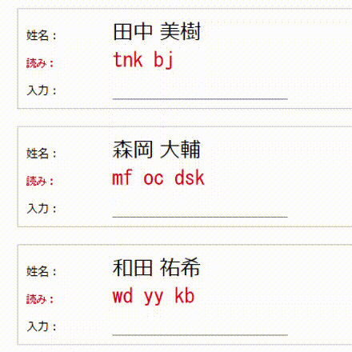

# direct-input23 用辞書のメンテナンスツール
 
direct-input23.ahk は、IME を使用せずに漢字を入力できる AutoHotkey 用のスクリプトです。



本ツールでは、direct-input23 で使用する辞書ファイルを表形式で閲覧しながら、単語の追加・編集・削除、および重複するエントリの解決を行えます。

direct-inpu23 本体の使い方および詳細については、note の記事「[IME を使用しない漢字の直接入力 (バージョン 1.1.0)](https://note.com/kouie/n/n6a04edd7f3ef)」をご覧ください。

ヒント: 本ツールは、辞書をいちから作成する用途には向いていません。direct-input23 での入力効率を上げるために、使用中の辞書を調整・最適化することを目的としています。多数のエントリの削除や置換など一括操作を行いたい場合は、テキストエディタを使用する方が簡単です。その際に本ツールを併用することで、辞書の構成を把握しやすくなるかもしれません。新しい単語を登録しようと思っても空いている読みがなかなか見つからないような場合にも、本ツールを試してみてください。

## インストールと実行方法

1. Python 3 を準備してください (必要に応じて venv など)。

2. PyQt5 を使用しますので pip install してください。

```
pip install PyQt5
```

3. dictionary-maintenance-tool.py を実行します。

```
python dictionary-maintenance-tool.py
```

メインウィンドウが表示されます。

## 使い方

ファイルを読み込んで、編集して、保存するだけのシンプル機能です。

重要: 編集した内容はまとめて保存しますので (逐次保存**されません**)、作業終了時にファイルの保存を忘れないよう気を付けてください。

### 各機能の説明


① [辞書選択] ボタン: クリックすると、ファイル選択のダイアログボックスが表示されます。辞書ファイルを選んで [開く] をクリックしてください。

② テーブル部: 選択した辞書の内容が表示されます。

③ [1 文字目] ドロップダウンボックス: テーブルに表示する単語群の読みの 1 文字目を指定します。たとえば、「f」を選択すると、「読みが 3 文字」かつ「読みが f で始まる」単語が抽出されてテーブルに表示されます。

読みが 2 文字の単語を表示したい場合は、「2文字」を選択してください。

ヒント: ドロップダウンを選択するごとにテーブルの内容が更新されますが、行った編集内容はすべて保持されています。テーブルを更新する前に毎回保存ボタンを押す必要はありません。

④ [フォントサイズ] ドロップダウンボックス: テーブルの文字サイズを変更します。

⑤ [デフォルト順]/[あいうえお末尾] ドロップダウンボックス: 切り替えると、単語の並び順を変更できます。作者がよく使うだけで、編集に必須の機能というわけではありません。

⑥ [上書き保存]、[名前を付けて保存] ボタン: 現在のテーブルの内容を保存します。

### エントリの編集

テーブルのセルをダブルクリックすると、値を編集するダイアログボックスが表示されます。


新しい語句を追加するか現在の登録内容を編集して、[OK] をクリックしてください。

登録している単語を削除する場合は、値を削除して (空欄にして) [OK] をクリックします。

#### 読みが重複して登録されている場合

辞書に重複して登録されている読みは背景色が赤色になり、ファイルに記述されているすべての単語がスラッシュ (/) 区切りで表示されます。


このセルをダブルクリックした場合も、通常どおりダイアログボックスが表示されますので、不要な部分を **スラッシュを含めて** 削除してください (値チェックはしません。スラッシュが残っていると、スラッシュごと辞書に登録されます)。

編集した結果は、重複するエントリのうち最初に現れる (ファイルの先頭に最も近い) 行に書き込まれ、残りの行は削除されます。

ヒント: direct-inpu23 では、読みが重複するエントリが見つかった場合、最後に登録したもの (ファイルの末尾にもっとも近いもの) が有効になります。先に登録したエントリが単純に上書きされるだけなので、必ず解決しなければならないというわけでもありません。ファイルの保存時に重複するエントリが残っていた場合は、元の辞書ファイルと同じ内容が出力されます。

### 辞書ファイルの保存

2 つの保存ボタンはどちらも、現在読み込まれているすべての登録単語を (テーブルに表示されていないもの＝読みの 1 文字目がドロップダウンで選択されていないものもすべて)、編集内容を反映して書き出します。

保存される単語は基本的に、元の辞書ファイル (の読み込み時の状態) と同じ順序で出力されます。単語登録と関係のないコメント等の行も、新しいファイルにそのまま保存されます。

重複が解決した行は削除され、新規に追加した単語はファイルの末尾に追加されます。

どちらのボタンを使用する場合でもファイルの上書きが発生する場合は、元の辞書ファイルが ``<日付>-<辞書ファイル名>.txt`` という形式の名前に変更され、``./mt_backup`` フォルダに保管されます。

## 免責事項

当ソフトウェアの使用に関連して生じたいかなる損害、損失、またはトラブルについても、一切の責任を負いません。これには、データの損失、収益の損失、ビジネスの中断、およびその他の金銭的損失が含まれますが、これに限られません。

## ライセンス

このリポジトリの内容は [MT License](./LICENSE) です。
